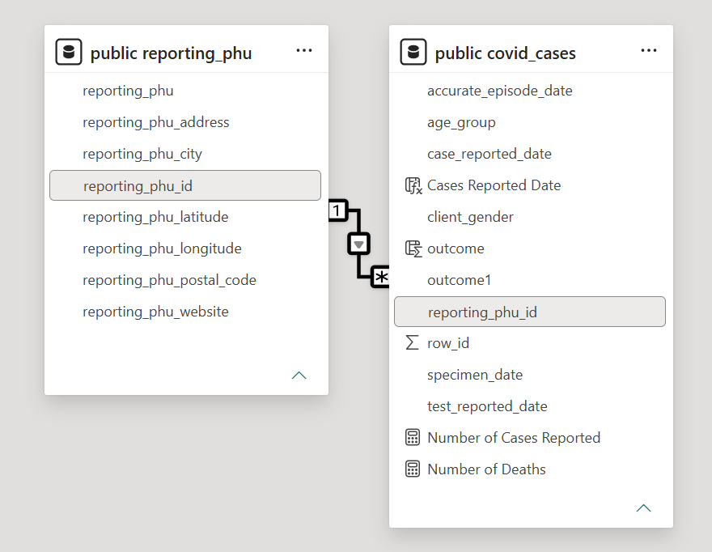

# COVID-19 Ontario (2020) Data Analysis Pipeline

## Overview

This project builds an end-to-end data analytics pipeline using confirmed COVID-19 case data reported in Ontario during 2020. The pipeline extracts data from a CSV file, performs basic cleaning using Python, loads the data into PostgreSQL, and visualize key insights in Power BI.

## Data Source

The COVID-19 case data for this project was obtained from Ontario Open Datasets

Source: https://data.ontario.ca/dataset/confirmed-positive-cases-of-covid-19-in-ontario

## Tech Stack

- <b>ETL:</b> Python (pandas, SQLAlchemy, psycopg2)
- <b>Databases:</b> SQL, PostgreSQL
- <b>Visualization:</b> Power BI

## ETL Process
The ETL pipeline consists of 3 stages
### 1. Extract
- Loaded the raw dataset from a CSV file using pandas.
- Inpsected the dataset for missing values and duplicate records.

### 2. Transform
Performed neccessary transformations, including:
- Standardized column names
- Removed duplicate records
- Handled missing values
- Separated the dataset into normalized tables: `covid_cases` and `reporting_phu`

### 3. Load
The cleaned data was loaded into PostgreSQL using SQLAlchemy.

## Relational Database Design
The database was normalized to reduce data redundancy by separating repeated Public Health Unit (PHU) information into its own table.



## Findings
The final Power BI dashboard includes:
- Total confirmed COVID-19 cases, including fatal cases
- Fatality rate by age group
- Cases by gender
- Case trends over time
- Distribution of cases by region
- Interactive filters and slicers for data exploration


Some key insights from the dashboard:
- Toronto reported the highest mumber of confirmed COVID-19 cases, followed by Missisauga
- Fatality rate increased with age, with the 90+ age group having the highest fatality rate
- Reporeted COVID-19 cases increased significantly between September and December 2020
- Male and female cases were distributed similarly, with no significant difference in the total number of reported cases.


## How to Run

### 1. Clone the repo
```
git clone https://github.com/ivng929/covid-ontario-analysis.git
cd covid-ontario-analysis
```

### 2. Install dependencies
```
pip install -r requirements.txt
```

### 3. Set up environment variables
```
DB_USER=postgres
DB_PASSWORD=your_password
DB_HOST=localhost
DB_PORT=5432
DB_NAME=covid_ontario_db
```
### 4. Run the ETL notebook
Open `notebooks/01_etl.ipynb`

Execute all cells to create database table and load CSV into PostgreSQL.

### 5. Build your dashboard
Connect Power BI to PostgreSQL and start building your Power BI dashboard.